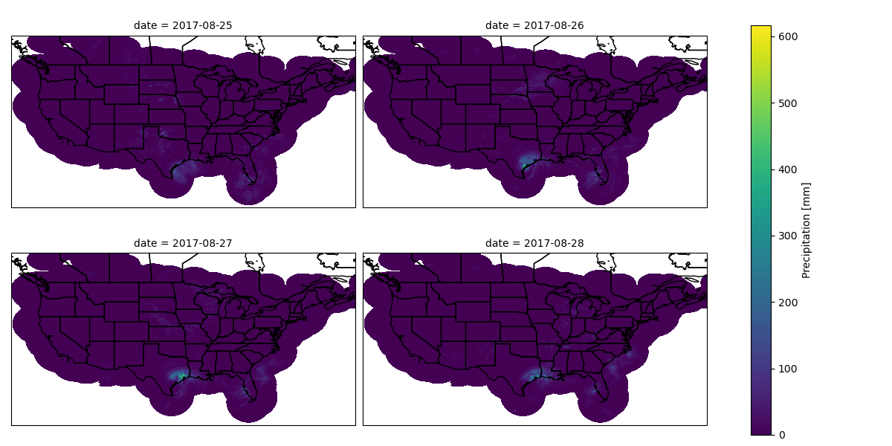

# NEXRAD-xarray

This is a **work in progress**!
Use this software **with caution**!
If you find it helpful please consider using the `Issues` tab to identify problems or suggest improvements.

The NOAA NEXRAD radar precipitation data is very useful for many hydrological applications, but it's stored in a confusing structure on a server hosted by Iowa State.
The individual files are stored as `.grib2` files, which has the advantage of keeping their size small but the disadvantage of being hard to use with the `dask`/`xarray` parallel processing pipeline.

This program creates a database of NEXRAD radar precipitation data in formats that are easy to use for analysis, specifically Netcdf4 files that play nicely with the [Pangeo](https://pangeo.io/) ecosystem and can be stored on a local hard drive.

## To run (quick version)

```shell
snakemake  --use-conda --cores SOME_NUMBER
```

where `SOME_NUMBER` is the number of cores you want to use.
See [Snakemake docs](https://snakemake.readthedocs.io/) for additional arguments you can pass.

## To run (long version)

For a bit more information

### About: data variables

We use the `MultiSensor_QPE_01H_Pass2` dataset when available and the `GaugeCorr_QPE_01H` for earlier periods.
See [docs](./doc/) for more information.

The basic steps of the analysis are

1. Download the `.grib2.gz` file from the Iowa State repository
1. Unzip the file from `.grib2.gz` to `.grib2`
1. Use the `cdo` tool to convert from `.grib2` to NetCDF 4 (`.nc`)
1. Leverage the `open_mfdataset` functionality in `xarray` to handle datasets spread across many files

### Installation

You will need Anaconda python installed.
Then

```shell
conda env create --file environment.yml # creates the environment
conda activate nexrad # activates the environment
```

All other required dependencies are described using Snakemake and custom anaconda environments (see [Snakemake docs](https://snakemake.readthedocs.io/)).

### About: storage requirements

One snapshot takes up approximately 3MB; one month requires about 2.55GB.

## Demo

If you run

```shell
snakemake  --use-conda --cores 1
```

Then you will download data for August 2017 to your drive.
You will need 2.55GB of storage.
You will also  produce the following plot:



which plots observed rainfall over the United States during Hurricane Harvey.
Unsurprisingly, SE Texas has the highest rainfall values.
If you can reproduce this plot, you can likely run the full analysis without problem.
